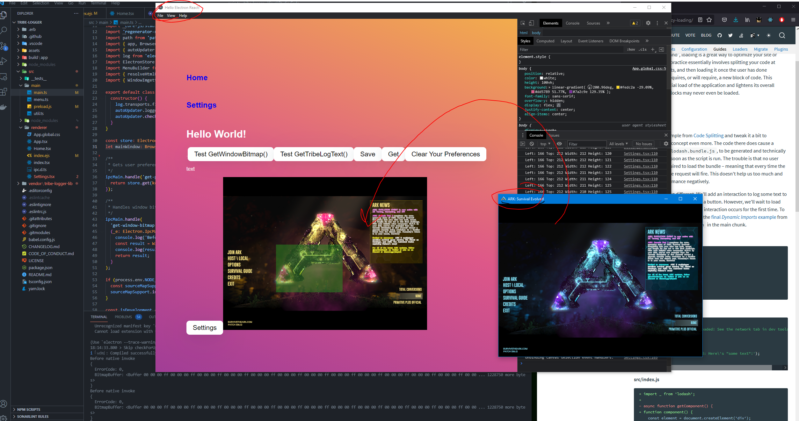
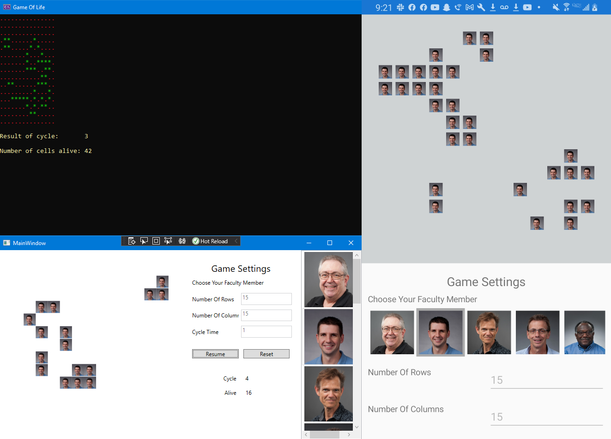
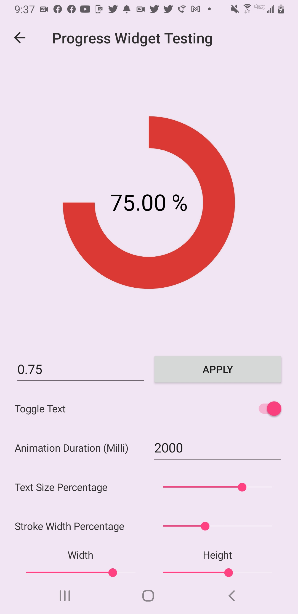
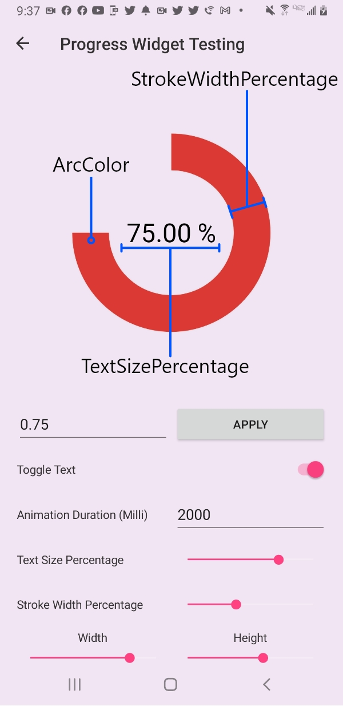
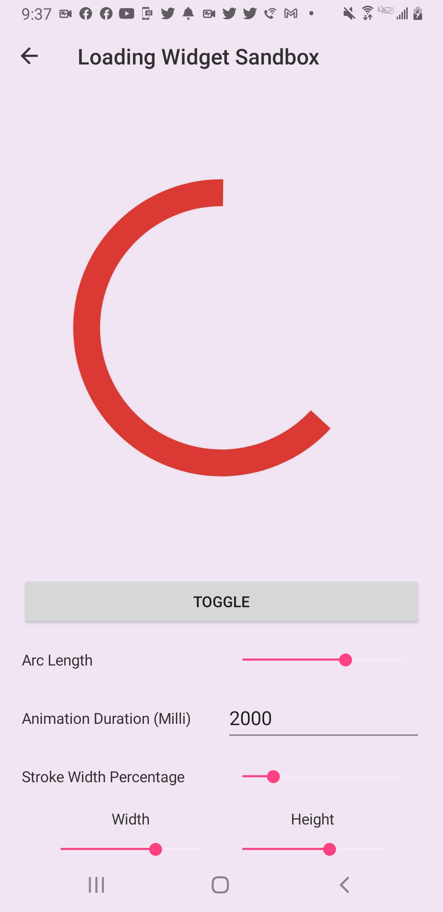
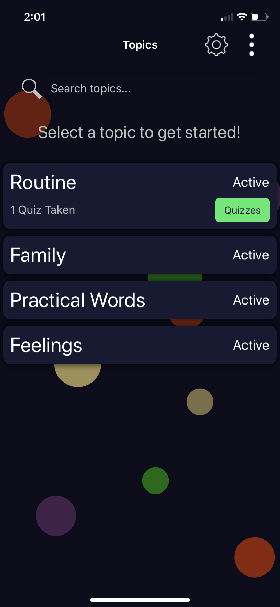
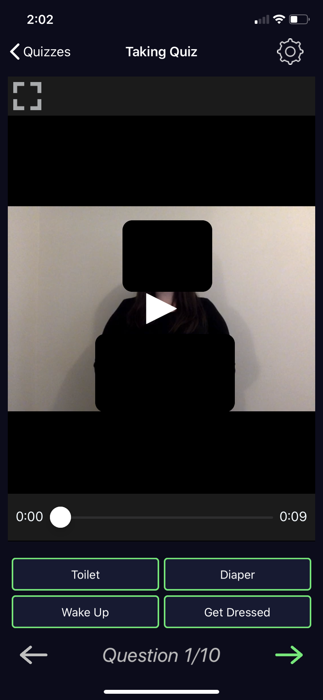
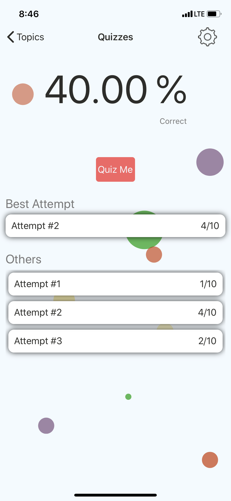

## Hello, I'm Chase 👋
I'm a 5th year Web and Mobile Computing undergraduate at <a href="https://www.rit.edu/">Rochester Institute of Technology</a>.

- 🌱 Learning and experiencing how to build and deploy personal projects *(checkout [.Docs](https://github.com/Chase-William/.Docs) for more info)*
- 🧪 Favorite technologies: [.NET](https://dotnet.microsoft.com/), [C#](https://docs.microsoft.com/en-us/dotnet/csharp/) ❤️, [TypeScript](https://www.typescriptlang.org/) 🙏🏻, [React](https://reactjs.org/), [Node.js](https://nodejs.org/en/), [Github](https://github.com/) 🤟, [Electron](https://www.electronjs.org/) 🤯, [Svelte](https://svelte.dev/), [GoLang](https://golang.org/), [SkiaSharp](https://docs.microsoft.com/en-us/xamarin/xamarin-forms/user-interface/graphics/skiasharp/)

#### Hobbies I enjoy other than coding 😉
- Weight Lifting 💪
- Reading *(currently reading <ins>[mindset](https://www.amazon.com/Mindset-Psychology-Carol-S-Dweck/dp/0345472322)</ins> by Carol S. Dweck, Ph. D.)* 📚
- Playing my six string Fender acoustic guitar 🎸
- Quotes, I like to memorize powerful quotes

#### Random Things about me
- I am hard of hearing so I know a decent amount of ASL and can communicate to a fair degree. 🤌
- I studied German during high school on my own accord since no classes were offered. I also took Deutsch *ein* (1) at RIT and so I can read/write/pronounce some basic statements.
- From playing tons of tank & plane games from my childhood, I have a vast knowledge base regarding WW1 & WW2 tanks & planes. Some of my favorite tanks are the [IS-3](https://en.wikipedia.org/wiki/IS-3), [IS-7](https://en.wikipedia.org/wiki/IS-7), [Panther A](https://en.wikipedia.org/wiki/Panther_tank), [Tiger I](https://en.wikipedia.org/wiki/Tiger_I), [Jagdpanzer IV](https://en.wikipedia.org/wiki/Jagdpanzer_IV), [T29 *With it's Ears* (rangefinders)](https://en.wikipedia.org/wiki/T29_Heavy_Tank), [T34](https://en.wikipedia.org/wiki/T34_Heavy_Tank), [The Jumbo *(m4a3e2)*](https://tanks-encyclopedia.com/ww2/us/m4a3e2-jumbo-assault-tank)

## Notable Projects:

### DotDocs *(.Docs)*

*DotDocs* is an intuitive & reliable documentation generator library for C# projects. Currently it produces markdown files as documentation and support for website generation is planned. The project is being released through chocolatey [here](https://community.chocolatey.org/packages/dotdocs), as well as in Github's releases [here](https://github.com/Chase-William/.Docs/releases). Visit [*.Docs*](https://github.com/Chase-William/.Docs) to learn more about the project!

The diagram below shows a high level flow of *DotDocs* using your local C# project files and processing the information to produce markdown files.

> Multiple local projects *(.csproj files)* are supported and different configurations with overrides are available to alter the produced documentation.

### Tribe Logger

*Tribe Logger* aims to provide members with updates/notification about tribe log information when in-game events occur. The updates/notifications are provided via a `Discord Bot`. For the client application, I am using `Electron` with my own native node addons to basically get text from a window using [`OCR`](https://en.wikipedia.org/wiki/Optical_character_recognition).

> To get text from a window, I first aquire bitmaps from a window on command using it's [Device Context](https://docs.microsoft.com/en-us/windows/win32/gdi/device-contexts). The bitmap is then either piped all the way up to the `TypeScript` / `JavaScript` to be displayed in a canvas *(for previewing)*, or given to [tesseract](https://github.com/tesseract-ocr/tesseract) *(building from source using [vcpkg](https://github.com/microsoft/vcpkg))* inside the native `C++` addon to decipher text and return it to the caller.

In the image below you can see it capturing a bitmap from the *ARK: Survival Evolved* window and then displaying it in the `Electron` app window. The green box is the area the user can crop for tesseract to scan for text. *(testing right now)*

Recently I ported the project to use this [template](https://github.com/electron-react-boilerplate/electron-react-boilerplate) to help speed up `React` integration.

#### Remaining:
 - Finish Front-End / Packaging *using [webpack](https://webpack.js.org/) | [babel](https://babeljs.io/)*
 - Build a `Rest API` coupled to a `DBMS` and it's database *(client authentication needed | going SQL style)*
 - Build the `Discord Bot` *(using [GoLang](https://golang.org/) & [discordGo](https://github.com/bwmarrin/discordgo))*

This repo is currently under active development and is private because of possible monetization once finished. 

### Game Of Life

This project was created for [ICS](https://www.rit.edu/ntid/ics) department and moreover the [SVP](https://www.rit.edu/ntid/svp) group of 2021. It is based off the [*Game Of Life*](https://en.wikipedia.org/wiki/Conway%27s_Game_of_Life) and is available on:
- Console *(.NET Core)*
- Desktop *(WPF .NET Core)*
- Mobile *(Android using Xamarin)*

> Note: The console also accepts input for *Rows*, *Columns*, and *Cycle Time*, but in the provided screenshot you cannot see it because it has been cleared away...*

I attended the event and assisted new students with building their own apps from this repo. Checkout the [repo](https://github.com/MAD-NTID/GameOfLife) if you want to see more or download it for youself.

### Lil Widgets

[*Lil Widgets*](https://github.com/Chase-William/LilWidgets) is a library that provides progress & loading widgets to `Xamarin.Forms`. The motive behind this project was I wanted to learn more about animations and how to create them. Therefore this project depends heavily on `SkiaSharp` and its various public packages.

I created the widgets from scratch using `SkiaSharp` and it's `SKCanvasView` type. I learned about creating my own `Delta-Time` implementation *(used it before in `Unity`)* and how to implement better animation update routines *(moving away from frame rate based update to time based)*. I never felt my own implementations were smooth enough so I ended up coupling my animations to the built-in [Animation](https://docs.microsoft.com/en-us/dotnet/api/xamarin.forms.animation?view=xamarin-forms) class *(uses native animation utilities)*.

> This project's underlying structure is based off [Microcharts](https://github.com/microcharts-dotnet/Microcharts), except *Lil Widgets* repo is coupled to `Xamarin.Forms` as I previously mentioned.

| Progress Widget | Progress Breakdown | Loading Widget |
| :---: | :---: | :---: |
|  |  |  |

Checkout more about this project at its [repo](https://github.com/Chase-William/LilWidgets)...

### Baby Fingers

The app, *Baby Fingers* uses `Xamarin.Forms` to provide both `Android` & `iOS` packages. It is available on both `Google Play` and the `Apple App Store`. The app provides various topics that have lessons within them with quizzes to test your memory once you're ready!

|  |  |  |
| :---: | :----: | :---: |
|  |  |  |

The *Baby Fingers* repo is not currently available to the public to protect the client.
