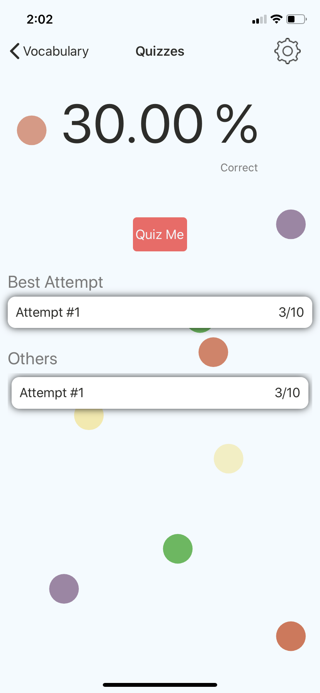

### Hello, I'm Chase 👋
I'm a 4th year Web and Mobile Computing undergraduate at <a href="https://www.rit.edu/">Rochester Institute of Technology</a>.

- 🌱 Learning & building an [electron](https://www.electronjs.org/) app with [React](https://reactjs.org/) which includes my very own [native node addon](https://nodejs.org/api/addons.html) using [nan](https://github.com/nodejs/nan)
- 🧪 Favorite technologies: [.NET](https://dotnet.microsoft.com/), [GoLang](https://golang.org/), [SkiaSharp](https://docs.microsoft.com/en-us/xamarin/xamarin-forms/user-interface/graphics/skiasharp/), [Unity](https://unity.com/),  [ML.NET](https://dotnet.microsoft.com/apps/machinelearning-ai/ml-dotnet)
- 🔭 Employed as a DevOps Engineer working with [HoloLens 2](https://www.microsoft.com/en-us/hololens/buy) Tech under the [CCL](https://www.rit.edu/ntid/nccl) and also as the Lead Tutor of the <a href="https://www.rit.edu/ntid/ics">ICS Department</a>.

## Notable Projects:

### Tribe Logger

*Tribe Logger* aims to provide members with updates/notification about tribe log information when in-game events occur. The updates/notifications are provided via a `Discord Bot`. For the client application, I am using `Electron` with my own native node addons to basically get text from a window using [`OCR`](https://en.wikipedia.org/wiki/Optical_character_recognition).

> To get text from a window, I first aquire bitmaps from a window on command using it's [Device Context](https://docs.microsoft.com/en-us/windows/win32/gdi/device-contexts). The bitmap is then either piped all the way up to the `TypeScript` / `JavaScript` to be displayed in a canvas *(for previewing)*, or given to [tesseract](https://github.com/tesseract-ocr/tesseract) *(building from source using [vcpkg](https://github.com/microsoft/vcpkg))* inside the native `C++` addon; to decipher text and return it to the caller.

In the image below you can see it capturing a bitmap from the *ARK: Survival Evolved* window and then displaying it in the `Electron` app window. The green box is the area the user can crop for tesseract to scan for text. *(testing right now)*

Recently I ported the project to use this [template](https://github.com/electron-react-boilerplate/electron-react-boilerplate) to help speed up `React` integration.

#### Remaining:
 - Finish Front-End / Packaging *using [webpack](https://webpack.js.org/) | [babel](https://babeljs.io/)*
 - Build a `Rest API` coupled to a `DBMS` and it's database *(client authentication needed | probs gonna go [mySQL](https://www.mysql.com/) 8.0)*
 - Build the `Discord Bot` *(using [GoLang](https://golang.org/) & [discordGo](https://github.com/bwmarrin/discordgo))*

This repo is currently under active development and is private because of possible monetization once finished. 

### Game Of Life

This project was created for [ICS](https://www.rit.edu/ntid/ics) department and moreover the [SVP](https://www.rit.edu/ntid/svp) group of 2021. It is based off the [*Game Of Life*](https://en.wikipedia.org/wiki/Conway%27s_Game_of_Life) and is available on:
- Console *(.NET Core)*
- Desktop *(WPF .NET Core)*
- Mobile *(Android using Xamarin)*

> Note: The console also accepts input for *Rows*, *Columns*, and *Cycle Time*, but in the provided screenshot you cannot see it because it has been cleared away...*

I attended the event and assisted new students with building their own apps from this repo. Checkout the [repo](https://github.com/MAD-NTID/GameOfLife) if you want to see more or download it for youself.

### Lil Widgets

[*Lil Widgets*](https://github.com/Chase-William/LilWidgets) is a library that provides progress & loading widgets to `Xamarin.Forms`. The motive behind this project was I wanted to learn more about animations and how to create them. Therefore this project depends heavily on `SkiaSharp` and its various public packages.

I created the widgets from scratch using `SkiaSharp` and it's `SKCanvasView` type. I learned about creating my own `Delta-Time` implementation *(used it before in `Unity`)* and how to implement better animation update routines *(moving away from frame rate based update to time based)*. I never felt my own implementations were smooth enough so I ended up coupling my animations to the built-in [Animation](https://docs.microsoft.com/en-us/dotnet/api/xamarin.forms.animation?view=xamarin-forms) class *(uses native animation utilities)*.

This project's underlying structure is based off [Microcharts](https://github.com/microcharts-dotnet/Microcharts), except *Lil Widgets* repo is coupled to `Xamarin.Forms` as I previously mentioned.

| Progress Widget | Progress Breakdown | Loading Widget |
| :---: | :---: | :---: |
|  |  |  |

Checkout more about this project at its [repo](https://github.com/Chase-William/LilWidgets)...

### Baby Fingers

The app, *Baby Fingers* uses `Xamarin.Forms` to provide both `Android` & `iOS` packages. It is available on both `Google Play` and the `Apple App Store`. The app provides various topics that have lessons within them with quizzes to test your memory once you're ready!

|  |  |  |
| :---: | :----: | :---: |
|  |  |  |

The *Baby Fingers* repo is not currently available to the public to protect the client.
